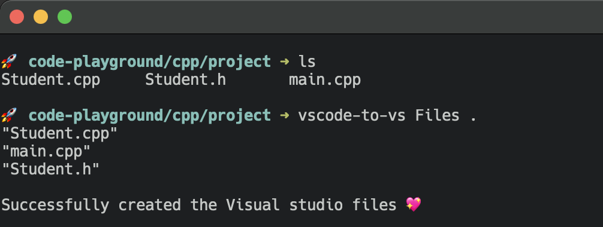
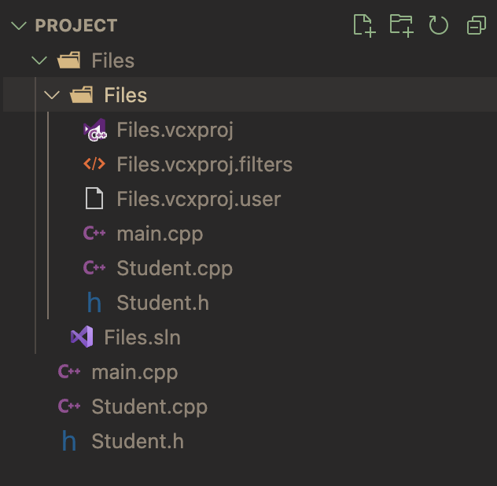

# vscode-to-vs

This command allows you to create the files needed for a Visual Studio C++ project. Mostly for operating systems that do not support Visual Studio C++ development.

## **Installation**
```
brew install wzid/tap/vscode-to-vs
```

<div align="center">
  
  ## 📝 [**Read the docs**](https://docs.cameron.rs/vscode-to-vs)

</div>

<div align="left">
  
  
</div>
